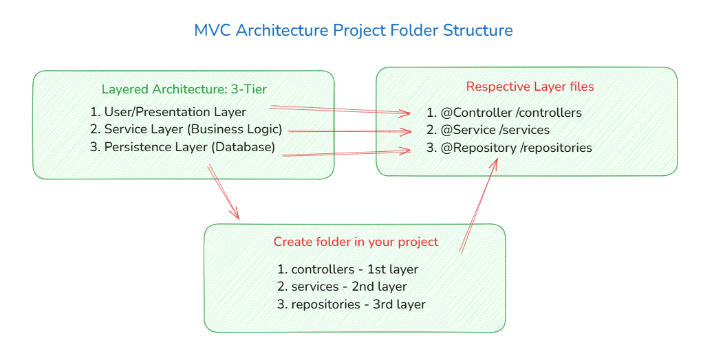
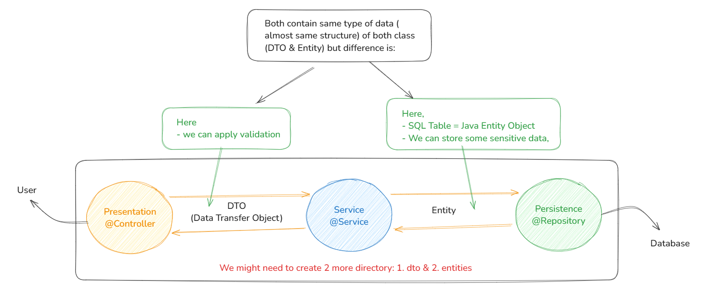

## SpringBoot Project Folder Structure 



## Importance of DTO and Entities



### Decision Table for Quick Reference

| **Annotation**     | **HTTP Method**                 | **When to Use**                                                | **Example**                                             |
|--------------------|----------------------------------|---------------------------------------------------------------|---------------------------------------------------------|
| `@GetMapping`       | GET                              | Use for handling **GET requests** that return data.           | `/products`, `/users/{id}`                              |
| `@PostMapping`      | POST                             | For creating resources or submitting data.                    | `/products`                                             |
| `@PutMapping`       | PUT                              | For updating resources.                                       | `/products/{id}`                                        |
| `@DeleteMapping`    | DELETE                           | For deleting resources.                                       | `/products/{id}`                                        |
| `@PatchMapping`     | PATCH                            | For partially updating resources.                              | `/products/{id}`                                        |
| `@RequestParam`     | Any (GET, POST, PUT, DELETE)     | For accessing **query parameters** in the URL.                | `/products?id=123&name=book`                            |
| `@PathVariable`     | Any (GET, POST, PUT, DELETE)     | For extracting **dynamic parts of the URL path**.             | `/products/{id}`, `/users/{userId}/posts`               |
| `@RequestHeader`    | Any (GET, POST, PUT, DELETE)     | For extracting **HTTP headers** from the request (e.g., Auth).| `Authorization: Bearer <token>`                         |
| `@RequestBody`      | POST, PUT, PATCH                | For binding the **request body** (typically JSON) to a method parameter. | `@RequestBody Product product`                          |


---

## `@GetMapping`
**Example**:
```java
  @GetMapping("/products")
  public String getProducts() {
      return "Returning list of products";
  }
```

## `@RequestParam`
Example:
```java
@GetMapping("/products")
public String getProductById(@RequestParam("id") String id) {
    return "Product ID: " + id;
}
```

Optional Parameters:
```java
@GetMapping("/products")
public String getProduct(@RequestParam(name = "id", required = false, defaultValue = "0") String id) {
    return "Product ID: " + id;
}
```

## `@PathVariable`
Example:
```java
@GetMapping("/products/{id}")
public String getProduct(@PathVariable("id") String id) {
    return "Product ID: " + id;
}
```

## `@RequestHeader`
Example:
```java
@GetMapping("/products")
public String getProduct(@RequestHeader("Authorization") String authToken) {
    return "Authorization Token: " + authToken;
}
```

## `@RequestBody`
Example:
```java
@PostMapping("/products")
public String createProduct(@RequestBody Product product) {
    return "Product created: " + product.getName();
}
```